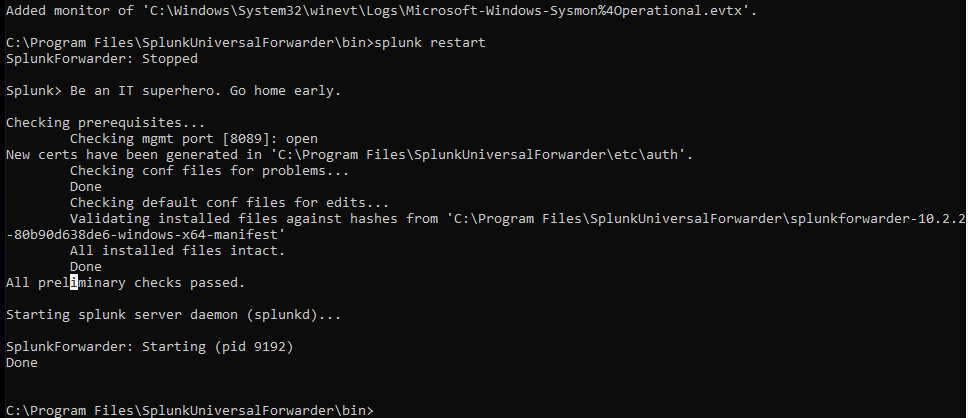
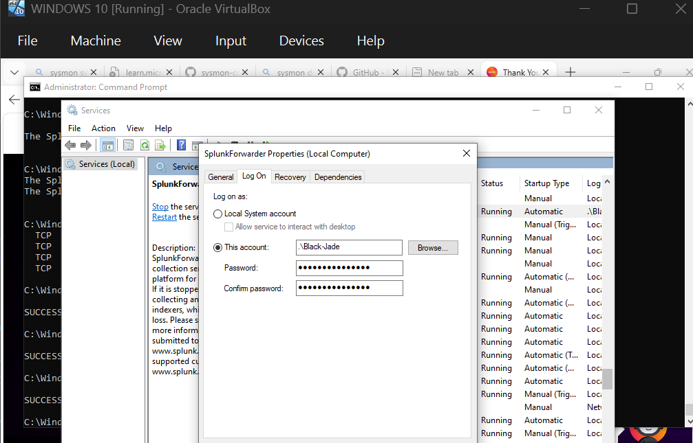
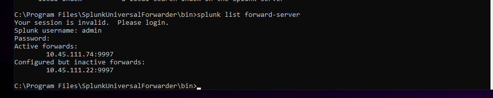
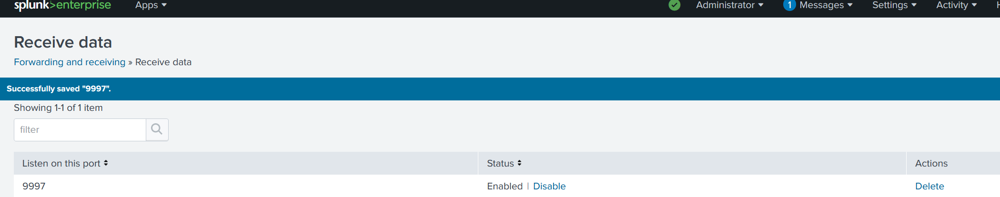
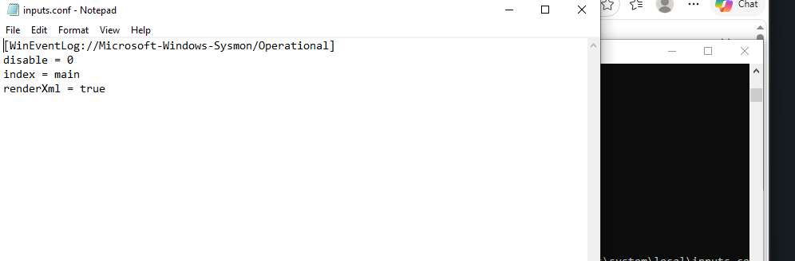
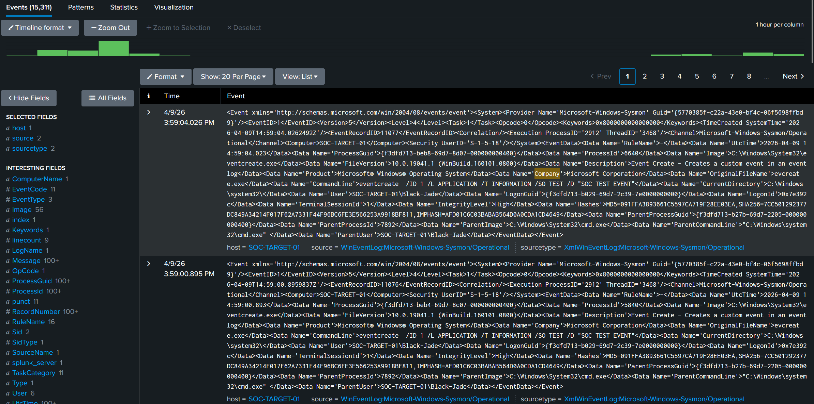
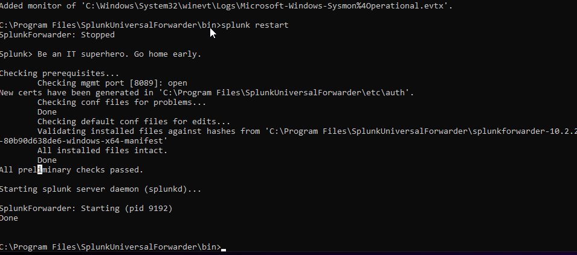
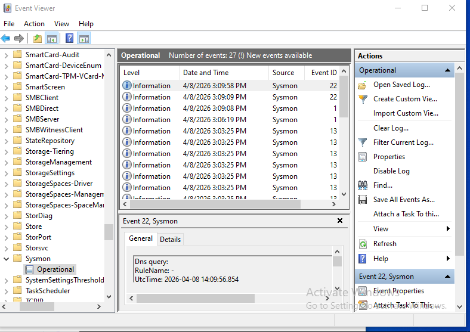

SOC Lab: Endpoint Monitoring & Log Ingestion with Splunk

 Overview

This project demonstrates the setup of a Security Operations Center (SOC) lab for collecting, forwarding, and analyzing endpoint logs using Splunk and Sysmon.

The lab simulates real-world log ingestion and troubleshooting scenarios, including resolving permission issues that prevented log collection.

----

 Architecture

Windows 10 Endpoint (Sysmon)
        |
Splunk Universal Forwarder
        |
Splunk Enterprise (Indexer)

---

 Tools Used

. Splunk Enterprise
. Splunk Universal Forwarder
. Sysmon
. Windows 10 (Virtual Machine - VirtualBox)

---

Issues Encountered

Logs were not appearing in Splunk despite successful connection between the forwarder and indexer.

Findings:

. Forwarder was connected on port 9997
. No logs were being ingested
. Error found in logs:
  Access is denied

Root Cause:

The Splunk Forwarder service was running under:

NT SERVICE\SplunkForwarder

This account did not have permission to read Windows Event Logs (Sysmon).

---

 Solution Implemented

. Changed service account to:

.\Black-Jade

. Granted "Log on as a service" permission
. Restarted Splunk Forwarder

---

 Commands Used

Restart Forwarder

net stop splunkforwarder
net start splunkforwarder

Verify Connection

netstat -ano | findstr 9997

Generate Test Logs

eventcreate /ID 1 /L APPLICATION /T INFORMATION /SO TEST /D "SOC TEST EVENT"

Splunk Search

index=main sourcetype=XmlWinEventLog*

---

 Results

. Sysmon logs successfully ingested
. Windows Application logs visible in Splunk
. Endpoint visibility established
. Log pipeline fully functional

---

 Detection Example

" index=main EventCode=1 "

Detects process execution events from Sysmon.

---

 Screenshots

Evidence of Log Pipeline

| Scenario | Screenshot |
|----------|------------|
| Forwarder Monitoring |  |
| Permission Issue |  |
| Service Running |  |
| Forwarder Connected |  |
| Receiving Port Configured |  |
| Sysmon Input Configured |  |
| Sysmon Logs in Splunk |  |
| Additional Sysmon Logs |  |
| Sysmon Operational Logs |  |

---

 Key Takeaways

. Connectivity does not guarantee log ingestion
. Service account permissions are critical
. Log files ("splunkd.log") are essential for troubleshooting
. Practical SOC troubleshooting skills were applied

- Simulate attacks and detect them
- Integrate additional log sources
